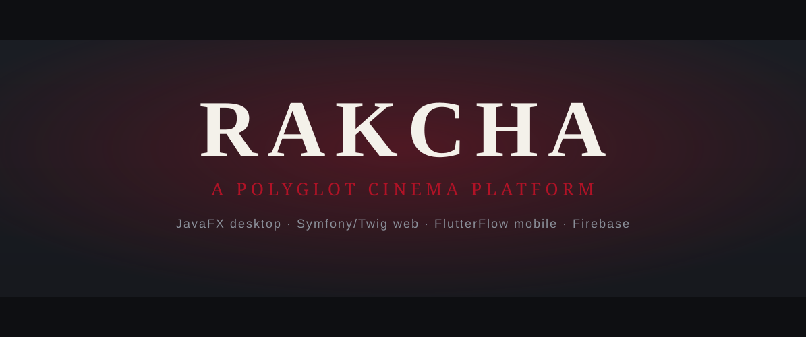

<div align="center">



# 🎬 RAKCHA

### A polyglot cinema platform — built as four independent apps

[](LICENSE)
[](.github/workflows/ci-web.yml)
[](.github/workflows/ci-desktop.yml)
[](.github/workflows/ci-mobile.yml)
[](mkdocs.yml)

</div>

---

## What RAKCHA actually is

RAKCHA is a cinema platform — film catalog, cinema/showtime management, online
reservations, and an e-commerce shop — implemented as **four independent
components** that share a problem domain but **not** a codebase or a runtime API:

| Component | Stack | How it reads data |
|---|---|---|
| **Desktop** — `apps/desktop` | JavaFX 21 + Maven | **JDBC directly to the DB** (HikariCP) |
| **Web** — `apps/web` | Symfony 6.4 server-rendered **MVC (Twig)** | Doctrine ORM |
| **Mobile** — `apps/mobile` | **FlutterFlow**-exported Flutter | Firebase / Firestore |
| **Functions** — `apps/mobile/firebase/functions` | Node (LangGraph + Anthropic) | Firebase Admin |

> **The honest architecture.** These are **three independent apps**, not one API
> with many clients. The desktop client talks to the database over JDBC — it does
> **not** call the web app over HTTP. The web app is a classic server-rendered
> Twig site (36 controllers, 71 templates), not an API product. The
> `shared/api-spec/openapi.yaml` file is an unimplemented stub that no controller
> serves, and no client generator is wired. The only cross-app integration is the
> **AI cinema concierge**, a Firebase callable that the mobile and web apps each
> reach directly over HTTPS.

The interesting story here is the **rare polyglot stack** — running one cinema
domain across a thick JavaFX desktop client, a Symfony/Twig server-rendered web
app, a FlutterFlow mobile app, and Firebase functions — and doing each with the
right tool rather than forcing a single shared API.

---

## Quick start (per app — they're independent)

### Desktop (JavaFX 21)

```bash
cd apps/desktop
mvn clean compile
mvn javafx:run          # launches com.esprit.MainApp
mvn verify              # JUnit5 + TestFX (headless/Monocle) + JaCoCo
```

Native installers (`.msi` / `.dmg` / `.deb`) are built by the jpackage matrix in
`.github/workflows/release-desktop.yml`.

### Web (Symfony / Twig)

```bash
cd apps/web
composer install
cp .env.example .env                       # default DATABASE_URL is SQLite
php bin/console doctrine:migrations:migrate
symfony server:start                       # http://localhost:8000
composer test                              # PHPUnit
composer phpstan                            # PHPStan (+ phpstan-symfony)
```

> No Node build — the dead Symfony Encore/JS was removed; assets load from a
> jsDelivr CDN.

### Mobile (FlutterFlow)

```bash
cd apps/mobile
flutter pub get
flutter run
flutter test --coverage    # scoped to hand-written code (see analysis_options.yaml)
```

### Firebase functions + AI concierge

```bash
cd apps/mobile/firebase/functions
npm install
npm run lint     # ESLint 9 (flat config)
npm test         # Vitest
```

---

## The AI cinema concierge

A film recommender built on the **`@langchain/langgraph` + `@langchain/anthropic`**
deps already in the functions package (model **`claude-haiku-4-5`**). It's a
Firebase **callable** that returns strict JSON recommendations, consumed
**independently** by:

- **Mobile** — `apps/mobile/lib/concierge/concierge_client.dart`
- **Web** — `apps/web/src/Service/ConciergeClient.php` (Symfony HttpClient)

No shared REST API: each app calls the same callable directly. See
[`docs/apps/functions.md`](docs/apps/functions.md).

---

## Project structure

```
rakcha/
├── apps/
│   ├── desktop/    # JavaFX 21 + Maven (JDBC) — README in apps/desktop
│   ├── web/        # Symfony 6.4 + Twig MVC   — README in apps/web
│   └── mobile/     # FlutterFlow Flutter app  — README in apps/mobile
│       └── firebase/functions/  # Node functions + AI concierge
├── docs/           # mkdocs-material site (architecture, per-app, schema)
├── shared/         # schema migration + (stub) api-spec
├── renovate.json   # single dependency bot for all ecosystems
└── mkdocs.yml
```

Per-app READMEs: [desktop](apps/desktop/README.md) ·
[web](apps/web/README.md) · [mobile](apps/mobile/README.md).

---

## Documentation

Built with **mkdocs-material** (`mkdocs build`), deployed to Cloudflare Pages
(gated on secrets). Covers the architecture of the three independent apps,
per-app build/run, the Twig page map, and the database schema — **no API
playground**, because there is no real API.

```bash
pip install -r requirements-docs.txt && mkdocs serve
```

---

## Engineering decisions

A few deliberate choices (full notes in [`docs/decisions.md`](docs/decisions.md)):

- **Independent apps, not one API → many clients.** The "one spec → clients"
  pipeline was never implemented; the apps are treated as the independent
  products they actually are.
- **CodeQL excludes PHP** (no PHP support) — the Symfony app's static gate is
  **PHPStan + phpstan-symfony** with a baseline.
- **One Renovate** at the root replaces a broken Dependabot (`/app/web` typo) +
  two colliding per-app configs.
- **AI as a Firebase callable**, consistent with the independent-apps reality —
  no new shared REST surface to maintain.
- **Cloudflare honesty:** Symfony (PHP) can't run on Workers — only the docs
  site goes to CF Pages; the PHP app needs a PHP host.

---

## License

RAKCHA is licensed under the **RAKCHA Commercial Use License**
(`SPDX-License-Identifier: LicenseRef-RAKCHA-Commercial`). Free for educational
and personal use; commercial use requires a license — see [LICENSE](LICENSE).

---

## Branding

The hero/social images are a **TODO** — see [BANNER.md](BANNER.md) for the
cinema-letterbox (2.39:1, theatre-red/charcoal) art direction.
`assets/banner.svg` is a committed local placeholder.

<div align="center">

**Made with ❤️ for cinema, across four stacks.**

</div>
