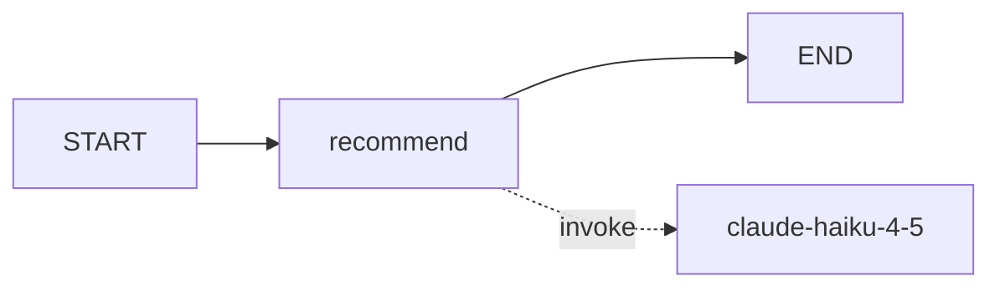

# Firebase functions & the AI cinema concierge

`apps/mobile/firebase/functions` — Node Firebase Cloud Functions. Besides an
auth-cleanup trigger (`onUserDeleted`), it hosts the **AI cinema concierge**.

## The concierge

`cinemaConcierge` is a Firebase **callable** built on the dependencies already
present in the project:

- **`@langchain/langgraph`** — orchestrates a small recommend graph.
- **`@langchain/anthropic`** — `ChatAnthropic`, model **`claude-haiku-4-5`**.

It takes a free-text prompt plus optional favorite genres and returns strict
JSON:

```json
{ "recommendations": [ { "title": "...", "reason": "...", "genres": ["..."] } ] }
```



### Consumed independently by two apps

There is **no shared REST API**. Both clients call the callable directly:

- **Mobile** — `apps/mobile/lib/concierge/concierge_client.dart`
- **Web** — `apps/web/src/Service/ConciergeClient.php` (Symfony HttpClient)

## Develop

```bash
cd apps/mobile/firebase/functions
npm install
npm run lint        # ESLint 9 (flat config, eslint.config.mjs)
npm test            # Vitest unit tests for the JSON parser
```

Set the Anthropic key before deploying:

```bash
firebase functions:config:set anthropic.key="sk-ant-..."   # gen-1 config
# or set ANTHROPIC_API_KEY in the function environment
```

!!! note "Fixed in this upgrade"
    The old `compile` script referenced a missing `tsconfig.template.json` (the
    functions are JS, not TS) and ESLint was pinned to `^6` (2019). Both are now
    fixed: the broken script is gone and ESLint is on `^9` with a flat config.
