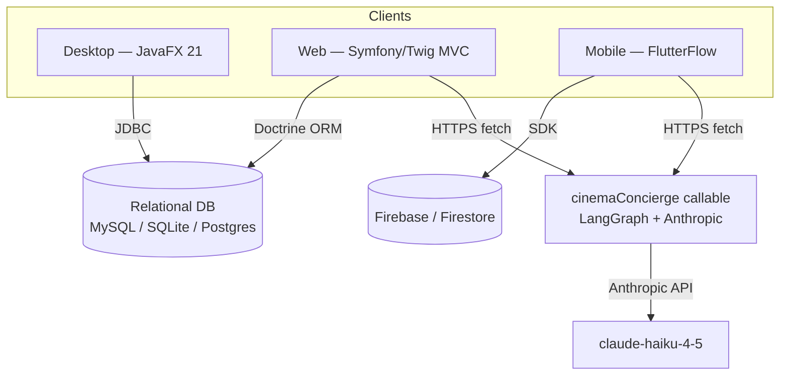

# Architecture

RAKCHA is a **monorepo of independent apps**, not a single distributed system.
Each app owns its own data path; they converge only at the shared database and at
one optional Firebase callable (the AI concierge).

## Key facts (verified against the code)

- **Desktop ⇄ DB only.** `apps/desktop` reads/writes the database via JDBC
  (HikariCP pool). It does not call the web app.
- **Web is server-rendered MVC.** `apps/web` has **36 controllers** that render
  **71 Twig templates** to HTML. Only a handful of endpoints return small AJAX
  `JsonResponse` payloads (cart total, bookmark toggle, etc.). It is **not** an
  API product.
- **There is no shared REST API.** An earlier `shared/api-spec/openapi.yaml`
  documented `/api/cinemas` / `/api/films` routes that no controller served, and
  `openapitools.json` wired no generator — both were **removed** as vaporware.
- **The only cross-app integration** is the AI concierge: a Firebase callable
  that the mobile and web apps each reach **directly over HTTPS** — independently.

## Why a monorepo without a shared API?

The apps were built by different tracks against the same domain. Keeping them in
one repo gives a single source of truth for the **schema** and shared assets,
while each app stays free to use the right tool (JavaFX desktop ergonomics,
Symfony/Twig for the server-rendered site, FlutterFlow for rapid mobile). See
[Engineering decisions](decisions.md).
