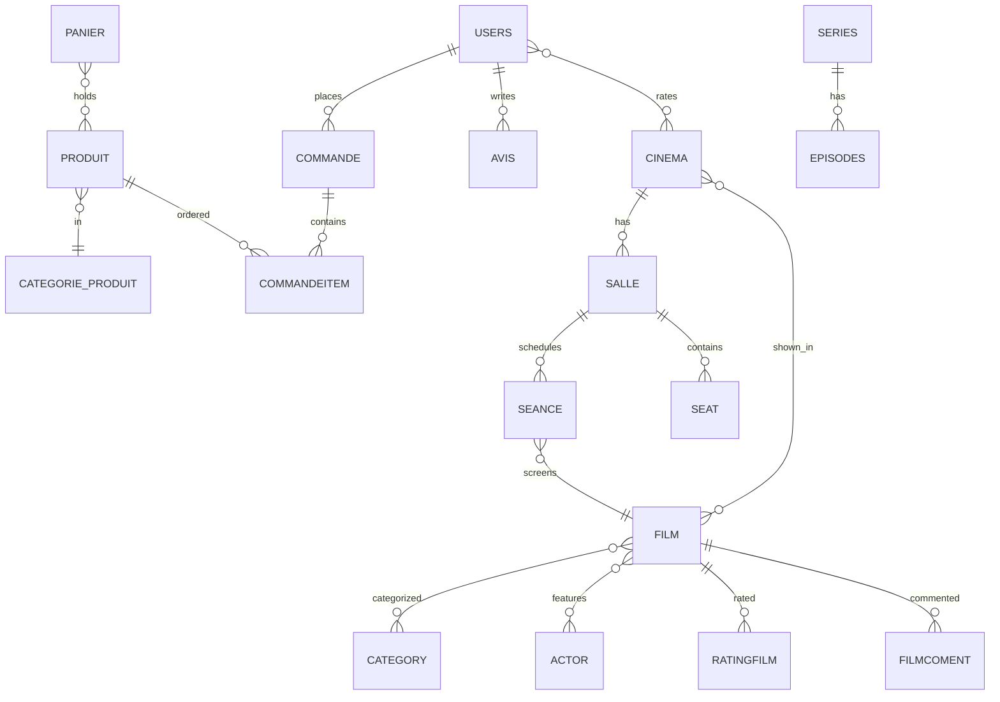

# Database schema

The relational schema is the closest thing RAKCHA has to a shared contract: the
**desktop** app reaches it over JDBC and the **web** app maps it with Doctrine
ORM (`apps/web/src/Entity`). The mobile app uses Firestore separately.

The canonical, machine-readable source is the Doctrine entity set under
`apps/web/src/Entity`. The diagram below summarizes the core domain.



## Domains

| Domain | Entities |
|---|---|
| **Cinema** | `Cinema`, `Salle`, `Seance`, `Seat` |
| **Film & series** | `Film`, `Category` / `Categories` / `Filmcategory`, `Actor` / `Actorfilm`, `Series`, `Episodes`, `Ratingfilm`, `Filmcoment`, `Favoris` |
| **E-commerce** | `Produit`, `CategorieProduit`, `Panier`, `Commande`, `Commandeitem`, `CommentaireProduit` |
| **Users & social** | `Users`, `Friendships`, `Avis`, `Feedback`, `Commentaire`, `Commentairecinema`, `Sponsor`, `ResetPasswordRequest` |

## Notes

- `Users.roles` is a JSON column. Migration `Version20250715040627` repairs
  rows that were double-encoded (`"[\"ROLE_CLIENT\"]"` → `["ROLE_CLIENT"]`),
  handling both SQLite and MySQL/MariaDB.
- Naming mixes French and English (`nom`, `adresse`, `responsable`,
  `commande`) — a historical artifact of the original team.
- The desktop app issues SQL against the same tables directly; keep the entity
  definitions and any desktop DAO queries in sync when the schema changes.

To regenerate a full schema dump:

```bash
cd apps/web
php bin/console doctrine:schema:create --dump-sql      # DDL the ORM would emit
```
